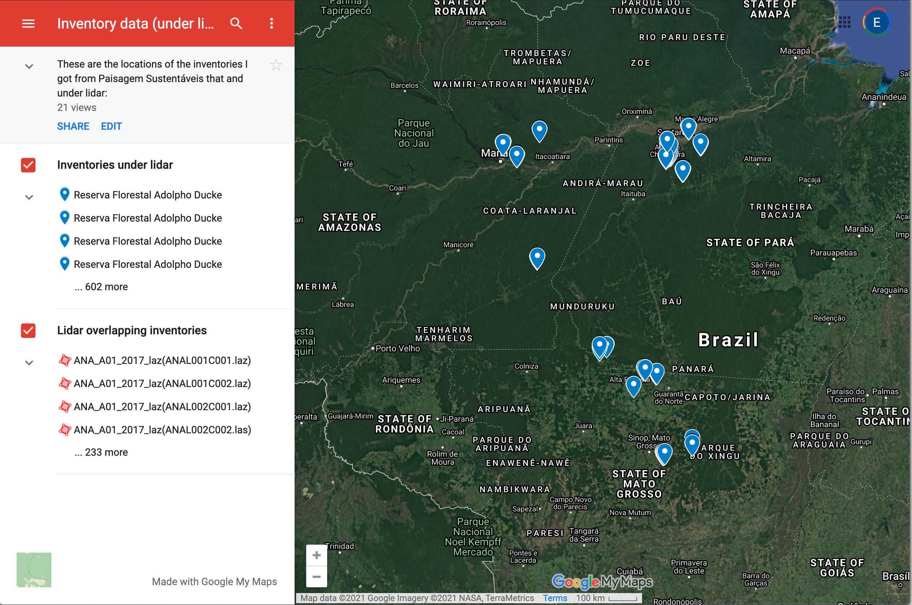

## Carbon Brazil

Sustainable landscapes data…

To date, some of what I have from Paisagem Sustantais

    ##          
    ##           2009 2010 2011 2012 2013 2014 2015 2016 2018
    ##   ANA_A01    0    0    0    0    0    0   32    0   32
    ##   AND_A01    0    0    0    0   20    0    0    0    0
    ##   BON_A01    0    0    0    0    0   10    0    0    0
    ##   CAU_A01    0    0    0   22    0  110    0    0   88
    ##   DUC_A01    5    0    5    0    0    0    0   17    0
    ##   FN_A01     0    0    0    0    0    0   36    0    0
    ##   HUM_A01    0    0    0    0    0   10    0    0    0
    ##   JAM_A01    0    0    2    0    0    0    0    0    0
    ##   JAM_A02    0    0    6    0   24    0    0    0    0
    ##   JAM_A03    0    0    0    0    4    0    0    0    0
    ##   PAR_A01    0    0    0    0   10    0    0    0   50
    ##   SAN_A01    0    0    0    0    0    8    0    8    0
    ##   SAN_A02    0    0    0    0    0    7    0    0    0
    ##   SFX_A01    0    0    9    0    0    0    0    0    0
    ##   TAC_A01    0    0    0    0    0   13   13    0    0
    ##   TAL_A01    0    0    0    0    0    5    0    0    0
    ##   TAP_A01    6   12   12    0    0    0    9    2    9
    ##   TAP_A03    0    0    0    0    0    0   10    0    0

## Map of inventories and lidar bounding boxes

click on the map!

## DBH-Height local models

    ## Linking to GEOS 3.8.1, GDAL 3.1.4, PROJ 6.3.1

## NMDS

Preliminary community analysis

.

